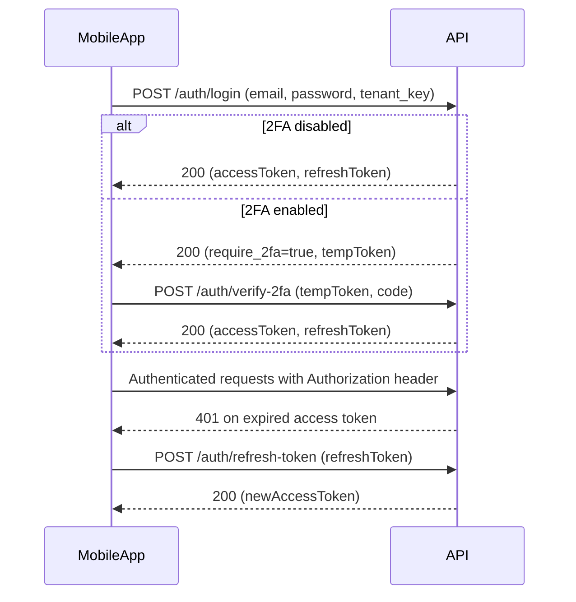

## TechHind Solar API – Mobile Auth & Profile Guide

This guide explains how mobile apps should use the **Auth & Profile** endpoints exposed in the `TechHind Solar API - Mobile Auth` Postman collection.

### 1. Environments & Base URL

- **Postman environments** are provided for:
  - `TechHind Mobile Auth - Local`
  - `TechHind Mobile Auth - Dev`
  - `TechHind Mobile Auth - Staging`
  - `TechHind Mobile Auth - Production`
- Each environment defines:
  - **`baseUrl`**: Full API base (e.g. `http://localhost:3000/api` or `https://{{tenantSubdomain}}.api.techhind.com/api`).
  - **`tenantSubdomain`**: Tenant identifier in the hostname (for multi-tenant shared deployments).
  - **`email`**: Default test user email.

For shared multi-tenant mode, the **subdomain** usually selects the tenant, for example:

- `https://tenant1.api.techhind.com/api`
- `https://tenant2.api.techhind.com/api`

In addition, some auth flows (notably `/auth/login`) may require a **`tenant_key`** in the request body when running in shared mode.

### 2. Standard Headers

For JSON APIs:

- **`Content-Type: application/json`** for all POST/PUT body requests.
- **`Authorization: Bearer <accessToken>`** for all protected endpoints:
  - Examples: `/auth/profile`, `/auth/change-password`, `/auth/logout`, `/auth/2fa/*`, `/user-master/profile`.

In the collection, protected requests already use:

- `Authorization: Bearer {{accessToken}}`

The `{{accessToken}}` variable is automatically set by the login or 2FA-verify requests (via Postman test scripts) when they succeed.

### 3. Auth Model Overview

- **Access token (short-lived)**:
  - JWT issued after successful login (or after 2FA verification).
  - Sent on every protected request using `Authorization: Bearer {{accessToken}}`.
- **Refresh token (longer-lived)**:
  - JWT used to get a new access token from `/auth/refresh-token`.
  - Stored as `{{refreshToken}}` in collection variables.
- **2FA (optional per user)**:
  - If 2FA is **disabled** for the user, `/auth/login` returns tokens directly.
  - If 2FA is **enabled**, `/auth/login` returns `require_2fa=true` and a `tempToken`; the app must call `/auth/verify-2fa` to complete login.
- **Multi-tenant behavior**:
  - Tenant is normally derived from subdomain (e.g. `tenant1.api.techhind.com`).
  - When the API is running in shared mode:
    - `/auth/login` may require an extra `tenant_key` field in the body to pick the tenant.
    - Password-reset public endpoints infer tenant from the incoming request (typically the host).

### 4. Typical Mobile Flows

#### 4.1 Login (no 2FA)

1. **Call** `POST {{baseUrl}}/auth/login` with JSON body:

   - `email`: user email.
   - `password`: user password.
   - `tenant_key`: required when backend is in shared multi-tenant mode (ask backend which value to use).

2. **Success response**:

   - Includes `accessToken` and `refreshToken`.
   - The Postman test script automatically sets:
     - `{{accessToken}}`
     - `{{refreshToken}}`

3. **App behavior**:

   - Store both tokens securely on device.
   - Immediately call `GET {{baseUrl}}/auth/profile` to fetch the current user profile.

#### 4.2 Login with 2FA

1. **Call** `POST {{baseUrl}}/auth/login` (same body as above).
2. **If 2FA is enabled** for the user, response will contain:

   - `require_2fa: true`
   - `tempToken: "<short-lived-token>"`

   The Postman test script stores `{{tempToken}}`.

3. **Prompt the user** for their 2FA code (from authenticator app).

4. **Call** `POST {{baseUrl}}/auth/verify-2fa` with:

   - `tempToken`: `{{tempToken}}`
   - `code`: user’s 2FA code (e.g. `123456`)

5. **Success response** from `/auth/verify-2fa`:

   - Includes `accessToken` and `refreshToken`.
   - Postman script updates:
     - `{{accessToken}}`
     - `{{refreshToken}}`
     - and clears `{{tempToken}}`.

6. **Use tokens** exactly like the non-2FA flow.

#### 4.3 Refresh Token

Access tokens are short-lived; when they expire the API usually returns **HTTP 401**.

1. When a protected request (e.g. `/auth/profile`) fails with **401 Unauthorized**:
   - The app should detect this as “access token expired”.
2. **Call** `POST {{baseUrl}}/auth/refresh-token` with:

   - `refreshToken`: from secure storage (or `{{refreshToken}}` in Postman).

3. **Success response**:

   - Contains `newAccessToken`.
   - Postman script sets `{{accessToken}} = newAccessToken`.

4. **Retry the original request** with the new access token.

If refresh token is invalid or expired, the API will reject it and the app must force a full re-login.

#### 4.4 Change Password (self-service)

Requires an authenticated user (valid access token).

1. **Call** `POST {{baseUrl}}/auth/change-password` with:

   - `current_password`
   - `new_password`
   - `confirm_password` (must match `new_password`)

2. On success, backend responds with a success message.
3. Recommended: force logout and ask the user to log in again with the new password.

#### 4.5 Forgot / Reset Password with OTP

Works **without** an access token; tenant is derived by backend from the incoming request (typically host/subdomain).

1. **Forgot password**:
   - Call `POST {{baseUrl}}/auth/forgot-password` with:
     - `email`: the user’s email.
   - API always returns a generic success message (even if email is not registered).
   - An OTP is sent to the email if the user exists.
2. **Verify OTP**:
   - Call `POST {{baseUrl}}/auth/verify-reset-otp` with:
     - `email`
     - `otp`
   - On success, API responds with `verified: true`.
3. **Reset password**:
   - Call `POST {{baseUrl}}/auth/reset-password` with:
     - `email`
     - `otp`
     - `new_password`
     - `confirm_password`
   - On success, password is updated and user can log in with the new credentials.

#### 4.6 Logout

1. **Call** `GET {{baseUrl}}/auth/logout` with header:

   - `Authorization: Bearer {{accessToken}}`

2. Backend deletes the stored token record and returns a success message.
3. The app should clear stored tokens and navigate user to login screen.

### 5. Fetching Current User Profile

Preferred endpoint for mobile:

- `GET {{baseUrl}}/auth/profile`
  - Headers:
    - `Authorization: Bearer {{accessToken}}`

Response includes:

- Basic user fields: id, name, email, status, role, 2FA flags, timestamps.
- `modules`: list/tree of modules with permissions (`can_create`, `can_read`, `can_update`, `can_delete`, etc.).

For admin/internal mobile apps you can also use:

- `GET {{baseUrl}}/user-master/profile`
  - Similar profile payload but under the user-master module, with module-read permission checks.

### 6. 2FA Management from Mobile

If the mobile app offers 2FA configuration screens:

- **Generate 2FA secret/QR**:
  - `POST {{baseUrl}}/auth/2fa/generate`
  - Requires `Authorization: Bearer {{accessToken}}`.
  - Optional body: `{ "issuer": "TechHindSolar" }`
  - Returns `secret` and `qrCodeUrl`.
- **Enable 2FA**:
  - `POST {{baseUrl}}/auth/2fa/enable` with body `{ "code": "123456" }`.
- **Disable 2FA**:
  - `POST {{baseUrl}}/auth/2fa/disable` (no body).

### 7. Sequence Diagram – Login, 2FA, Refresh

### 8. Using the Postman Collection

- **Step 1**: Import:
  - `postman/mobile-auth.postman_collection.json`
  - One of the environment files under `postman/environments/`.
- **Step 2**: Select the correct environment in Postman (Local/Dev/Staging/Prod).
- **Step 3**: Update environment variables:
  - `tenantSubdomain` to match your tenant.
  - `email` and passwords to match a real test user.
- **Step 4**: Run through flows in this order:
  1. `Auth / Login & Tokens > Login`
  2. If needed, `Auth / Login & Tokens > Verify 2FA`
  3. `Auth / Profile & 2FA > Get Current User Profile`
  4. Optionally test `Auth / Password` and `/auth/refresh-token`.

Once validated in Postman, mirror the same URLs, headers, and JSON bodies in the mobile app’s networking layer. The key is to always send the latest `accessToken` in the `Authorization` header and use `refreshToken` only for `/auth/refresh-token`.

